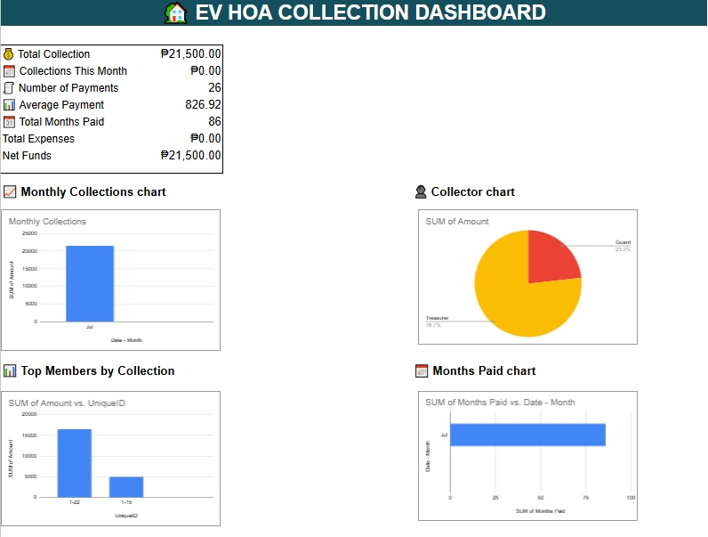
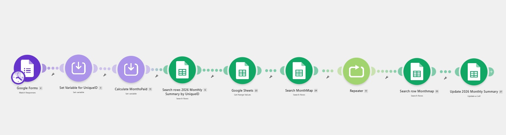
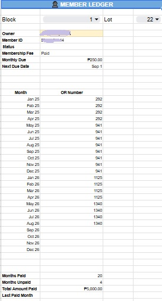
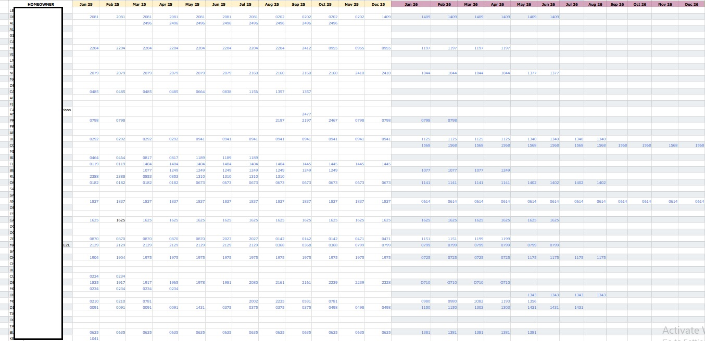
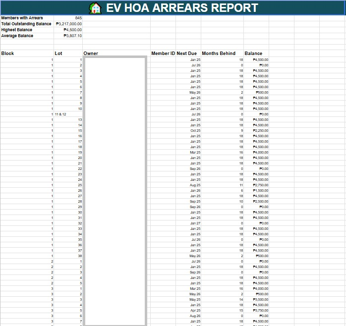
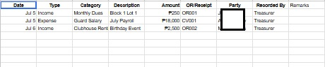
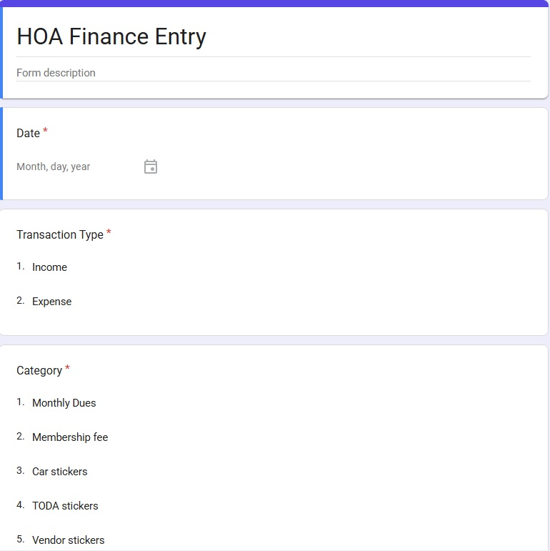
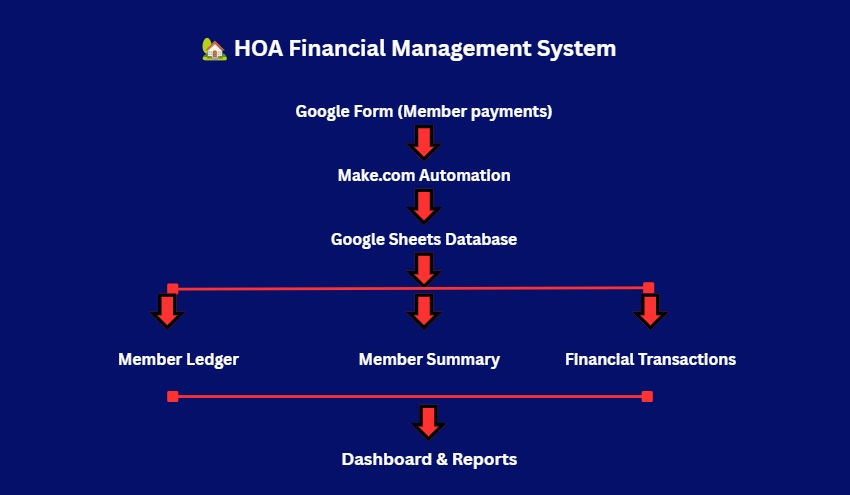

# 🏡 HOA Financial Management System & Workflow Automation

## 📖 Overview

The GitHub repository contains the complete project documentation for the HOA Management System.

## 📂 Repository Contents

- Project Documentation
- Workflow Diagrams
- Database Design
- Automation Logic
- System Architecture
- Portfolio Screenshots
- User Documentation
  
Purpose

The repository serves as a portfolio demonstration of workflow automation, project management, and no-code system development.

## 🛠 Technologies

- Google Workspace
- ClickUp
- Make.com
- Looker Studio
- AppSheet
  
Portfolio

## 💼 This project demonstrates

- Workflow Automation
- Project Management
- Database Design
- Process Documentation
- Financial System Design
- Future Improvements

## 🚀 Planned Enhancements

- AI-powered reporting
- Mobile application integration
- Email notifications
- Resident self-service portal
- Advanced analytics

---

# 📸 System Preview

## 📊 Dashboard

---

## 🔄 Make.com Payment Automation

---

## 👥 Member Ledger

---

## 📋 Monthly Summary

---

## 📈 Arrears Report

---

## 💰 Financial Transactions

---

## 📊 Finance Entry Form

---

## 🏗️ System Architecture

---

## 🎯 Business Problem

Many homeowners' associations still manage dues, expenses, and reports manually using spreadsheets, resulting in:

- Time-consuming payment posting
- Manual computation of arrears
- Duplicate records
- Delayed financial reports
- Limited visibility into HOA finances

---

## 💡 Solution

This project automates the HOA financial workflow using Google Workspace and Make.com, providing:

- Automated payment posting
- Real-time member ledger updates
- Expense tracking
- Financial dashboards
- Automated arrears monitoring
- Dynamic reports

---

## 📈 Business Impact

✔ Reduced manual payment posting

✔ Improved reporting accuracy

✔ Automated monthly financial summaries

✔ Simplified HOA bookkeeping

✔ Centralized homeowner records

✔ Increased operational efficiency
